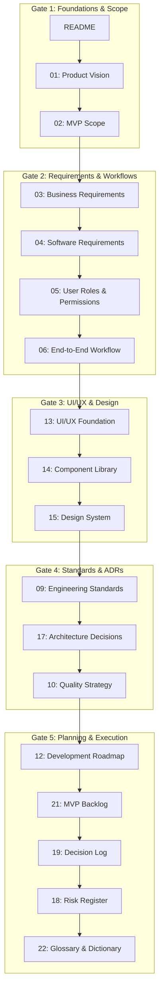

# Microbiology LIMS - Project Foundation & Documentation Index

## Document Metadata
*   **Document ID**: LIMS-DOC-00
*   **Version**: 1.0.0
*   **Author**: Antigravity (LIMS Solution Architect)
*   **Status**: Under Review
*   **Last Updated**: 2026-07-03
*   **Dependencies**: None
*   **Requested By**: Product Management & Stakeholders
*   **Reviewed By**: Technical Architect & QA Lead
*   **Approved By**: Pending User Review
*   **Approval Date**: Pending

---

## Purpose
This document serves as the root entry point, documentation index, and architectural overview for the Microbiology Laboratory Information Management System (Microbiology LIMS). It defines the directory structure of the repository, explains the reading order and dependencies between all architectural documents, tracks approval status across validation gates, and establishes guidelines for how future implementation milestones will utilize these specifications.

---

## Project Principles
These core principles represent the foundational "constitution" of the Microbiology LIMS project and must guide all architectural design, frontend development, backend logic, and operational deployment:
*   **Frontend-First Development**: All UI pages, layouts, state configurations, and interactive actions are developed using mock data services before backend database and API development. This establishes user flow clarity first.
*   **Business Workflow Driven**: Technical implementations must serve clinical and operational laboratory workflows first, rather than forcing workflows to adapt to database layouts.
*   **Domain-Driven Design**: Code modules, folders, databases, and microservices are aligned directly with domain boundaries (e.g., Specimen, AST, Culturing, Pathology).
*   **Component First**: Focus on building atomic, reusable, and encapsulated components. Avoid ad-hoc, page-specific styles or duplicate UI elements.
*   **Documentation Before Development**: No implementation is executed without preceding, peer-reviewed, and approved specification documents.
*   **Security By Design**: Data protection, HIPAA compliance, encryption at rest and in transit, and role-based access control (RBAC) are designed into the core model rather than bolted on later.
*   **Performance By Design**: Sub-second UI transition, responsive layouts, data indexing, and efficient network caching are treated as functional requirements.
*   **Accessibility First**: Complete WCAG 2.1 AA design standards are built into the design tokens and components from day one.
*   **Reusability Over Duplication (DRY)**: Abstract common helpers, UI patterns, and schemas into shared modules.
*   **Testability**: System modules must be decoupled to allow comprehensive unit testing, automated E2E coverage, and device-level testing.
*   **Observability**: Integrated audit logging, telemetry metadata, validation audit trails, and application performance metrics are standard engineering constraints.
*   **Production Readiness**: Code structure, environmental management, database schema migrations, and deployment files are designed for enterprise SaaS scalability from initial commit.

---

## Source of Truth
Approved documentation is considered the **single source of truth** for the project. 
*   All frontend layouts, backend schemas, API endpoints, and validation rules must adhere strictly to these specifications.
*   If an implementation detail conflicts with this documentation, the **documentation must be updated and approved first** before any code changes are written or committed.

---

## Coding Freeze Rule
To enforce planning integrity, prevent code churn, and ensure architectural alignment:
*   **No implementation code (frontend or backend) may be written, committed, or pushed to the repository** until all 5 Gates of the Project Foundation Milestone are fully reviewed and **Approved**.
*   Work during Milestone 1 is restricted strictly to markdown specifications within `docs/` and root configuration/directory templates.

---

## Document Status Definitions
Each document in the system carries one of the following statuses, reflecting its lifecycle stage:
*   **Draft**: The document is under active generation and not yet complete or ready for formal review.
*   **Under Review**: The document has been completed by the author and is awaiting user review, comments, and corrections.
*   **Approved**: The document has been formally accepted by the user and serves as the active source of truth.
*   **Superseded**: The document has been replaced by a newer version due to changing requirements or updated architecture.
*   **Deprecated**: The document remains for reference, but its contents are marked for removal and should not be used for implementation.
*   **Archived**: Historical document that is no longer active, kept only for audit compliance.

---

## Versioning & Change Management Rules
Documents follow a semantic versioning pattern (`Major.Minor.Patch`) modified for documentation context:
*   **Major Version (`1.0.0`)**: Triggered by structural architecture changes, new pillars, or directory re-organization.
*   **Minor Version (`0.1.0` or `1.1.0`)**: Triggered by new requirement sections, updated module definitions, or structural changes to existing specifications.
*   **Patch Version (`1.0.1`)**: Triggered by minor corrections, typographical adjustments, link updates, or clarification additions.

Any modification to an approved document must be accompanied by an entry in its Revision History, showing:
1.  **Requested By**: Name of the stakeholder asking for the change.
2.  **Reviewed By**: The technical lead reviewing the update.
3.  **Approved By**: The user authorizing the version update.
4.  **Approval Date**: Exact date approval was granted.

---

## Scope
This document covers the structure of the entire project repository (including folders reserved for future code implementation) and indexes all 22 foundational planning documents generated during Milestone 1. It does not contain functional code or database scripts.

---

## Main Content

### 1. Repository Directory Structure
The repository is structured to support a modular, component-driven, frontend-first SaaS application. Below is the mapping and purpose of each high-level directory:

| Directory | Purpose |
| :--- | :--- |
| `README.md` | This root index document, containing version tracking, roadmaps, and document mapping. |
| `docs/` | Contains all 22 detailed architectural, requirement, design, and roadmap specifications. |
| `frontend/` | Vite-based React Single Page Application (SPA). To be initialized in Milestone 2. |
| `backend/` | Node.js/Express REST API server and database migration scripts. To be initialized in Milestone 5. |
| `shared/` | Shared TypeScript types, Zod validation schemas, and common constants to prevent duplication. |
| `tests/` | Global end-to-end (Playwright) test scripts and system-level validation configurations. |
| `scripts/` | Local development helper scripts, mock data generators, and local build/deployment triggers. |
| `deploy/` | Dockerfiles, Kubernetes manifests, Helm charts, and terraform infrastructure configurations. |
| `assets/` | Shared UI images, mock document assets, report design layouts, and test barcode images. |
| `.github/` | CI/CD pipelines (GitHub Actions), issue templates, and Pull Request review templates. |

---

### 2. Milestone Status Table
The progress of the overall project foundation is tracked via the active status of each milestone:

| Milestone | Objectives | Status |
| :--- | :--- | :--- |
| **Milestone 1: Project Foundation** | Architectural documentation, workflows, designs, and backlog. | 🟡 **In Progress** |
| **Milestone 2: Frontend Foundation** | Setup React/Vite, UI/UX libraries, design token CSS, folder routing. | ⏳ **Planned** |
| **Milestone 3: Shared Components** | Reusable atomic library implementation. | ⏳ **Planned** |
| **Milestone 4: UI Development** | Interface mockup templates, state machines, page navigation. | ⏳ **Planned** |
| **Milestone 5: Backend & Database** | Node/Express backend scaffolding, DB schemas, migration setups. | ⏳ **Planned** |
| **Milestone 6: API Integration** | Connecting mock data to actual REST/GraphQL endpoints. | ⏳ **Planned** |
| **Milestone 7: Quality & Testing** | Complete unit, integration, visual regression, and E2E test suites. | ⏳ **Planned** |
| **Milestone 8: Deployment & CI/CD**| Docker orchestration, cloud pipeline releases, staging validation. | ⏳ **Planned** |
| **Milestone 9: Maintenance & Audit**| Monitoring telemetry, performance tuning, compliance readiness checks.| ⏳ **Planned** |

---

### 3. Document Index & Reading Order
The document pipeline has been updated to follow a sequential dependency trail where requirements drive permissions, which in turn map the end-to-end laboratory workflows.

| Doc ID | File Path | Document Name | Pillar | Dependencies | Purpose / Description | Status |
| :--- | :--- | :--- | :--- | :--- | :--- | :--- |
| **LIMS-DOC-00** | [README.md](file:///d:/Projects/Micro_Lab/README.md) | Documentation Index | Index | None | Central repository index and reading guide. | **Under Review** |
| **LIMS-DOC-01** | [01_product_vision.md](file:///d:/Projects/Micro_Lab/docs/01_product_vision.md) | Product Vision Document | Product | LIMS-DOC-00 | Defines target users, success metrics, and long-term vision. | Approved |
| **LIMS-DOC-02** | [02_mvp_scope.md](file:///d:/Projects/Micro_Lab/docs/02_mvp_scope.md) | MVP Scope Document | Product | LIMS-DOC-01 | Defines what is in/out of scope for MVP release. | Approved |
| **LIMS-DOC-03** | [03_business_requirements.md](file:///d:/Projects/Micro_Lab/docs/03_business_requirements.md) | Business Requirements Spec (BRS) | Business | LIMS-DOC-02 | Captures lab rules, regulations, and high-level workflows. | Approved |
| **LIMS-DOC-04** | [04_software_requirements.md](file:///d:/Projects/Micro_Lab/docs/04_software_requirements.md) | Software Requirements Spec (SRS) | Engineering| LIMS-DOC-03 | Defines detailed functional/non-functional requirements. | Approved |
| **LIMS-DOC-05** | [05_user_roles_permissions.md](file:///d:/Projects/Micro_Lab/docs/05_user_roles_permissions.md) | User Roles & Permissions Matrix | Business | LIMS-DOC-04 | Establishes role definitions and RBAC permission tables. | Approved |
| **LIMS-DOC-06** | [06_end_to_end_workflow.md](file:///d:/Projects/Micro_Lab/docs/06_end_to_end_workflow.md) | End-to-End Lab Workflow | Business | LIMS-DOC-05 | Details 18 workflow phases (Registration to Archival). | Approved |
| **LIMS-DOC-07** | [07_functional_modules.md](file:///d:/Projects/Micro_Lab/docs/07_functional_modules.md) | Functional Module Breakdown | Engineering| LIMS-DOC-04 | Deconstructs system modules and module dependencies. | Awaiting |
| **LIMS-DOC-08** | [08_frontend_strategy.md](file:///d:/Projects/Micro_Lab/docs/08_frontend_strategy.md) | Frontend Development Strategy | Engineering| LIMS-DOC-04 | Sets architectural blueprints for React/Vite client. | Awaiting |
| **LIMS-DOC-09** | [09_engineering_standards.md](file:///d:/Projects/Micro_Lab/docs/09_engineering_standards.md) | Engineering Standards | Engineering| LIMS-DOC-08 | Syntax conventions, git flow, and commit guidelines. | Awaiting |
| **LIMS-DOC-10** | [10_quality_strategy.md](file:///d:/Projects/Micro_Lab/docs/10_quality_strategy.md) | Quality Strategy | Engineering| LIMS-DOC-09 | Formulates testing pyramids, CI/CD gates, and DoD. | Awaiting |
| **LIMS-DOC-11** | [11_documentation_structure.md](file:///d:/Projects/Micro_Lab/docs/11_documentation_structure.md) | Documentation Structure | Engineering| LIMS-DOC-00 | Hierarchy for maintaining wikis, manuals, and runbooks. | Awaiting |
| **LIMS-DOC-12** | [12_development_roadmap.md](file:///d:/Projects/Micro_Lab/docs/12_development_roadmap.md) | Development Roadmap | Engineering| LIMS-DOC-02 | Milestone schedules for frontend, backend, and launch. | Awaiting |
| **LIMS-DOC-13** | [13_ui_ux_foundation.md](file:///d:/Projects/Micro_Lab/docs/13_ui_ux_foundation.md) | UI/UX Foundation Document | Product | LIMS-DOC-05, LIMS-DOC-06 | Navigation hierarchy, layouts, user journeys, and accessibility. | Approved |
| **LIMS-DOC-13A** | [13a_ui_state_dictionary.md](file:///d:/Projects/Micro_Lab/docs/13a_ui_state_dictionary.md) | UI State Dictionary | Product | LIMS-DOC-06, LIMS-DOC-13 | Single source of truth for every UI state, transition rule, and UX consistency rule. | Approved |
| **LIMS-DOC-13B** | [13b_interaction_pattern_library.md](file:///d:/Projects/Micro_Lab/docs/13b_interaction_pattern_library.md) | Interaction Pattern Library | Product | LIMS-DOC-06, LIMS-DOC-13, LIMS-DOC-13A | Canonical reference for every user interaction behavior (75+ named patterns). | Approved |
| **LIMS-DOC-14** | [14_component_library.md](file:///d:/Projects/Micro_Lab/docs/14_component_library.md) | Component Library Specs | Product | LIMS-DOC-13, LIMS-DOC-13A, LIMS-DOC-13B | Detailed reuse patterns for atomic design components. | Approved |
| **LIMS-DOC-15** | [15_design_system.md](file:///d:/Projects/Micro_Lab/docs/15_design_system.md) | Design System | Product | LIMS-DOC-13 | Defines CSS color scales, typography, grid, and spacing. | Approved |
| **LIMS-DOC-16** | [16_enterprise_engineering_architecture.md](file:///d:/Projects/Micro_Lab/docs/16_enterprise_engineering_architecture.md) | Enterprise Engineering Architecture | Engineering| LIMS-DOC-14, LIMS-DOC-15 | Master blueprint for repository structure, module layers, and delivery lifecycles. | Approved |
| **LIMS-DOC-16A** | [16a_ai_development_playbook.md](file:///d:/Projects/Micro_Lab/docs/16a_ai_development_playbook.md) | AI Development Playbook | Engineering| LIMS-DOC-16 | Standard operating procedure for AI-assisted development across all workflow lifecycle phases. | Approved |
| **LIMS-DOC-17** | [17_feature_specification_template.md](file:///d:/Projects/Micro_Lab/docs/17_feature_specification_template.md) | Feature Specification Template | Product | LIMS-DOC-16 | Standard layout structure for documenting individual modules consistently. | Approved |
| **LIMS-DOC-18** | [18_architecture_decisions.md](file:///d:/Projects/Micro_Lab/docs/18_architecture_decisions.md) | Architectural Decisions (ADRs) | Engineering| LIMS-DOC-16 | High-level technical choices (Frontend First, JWT, etc.). | Approved |
| **LIMS-DOC-19** | [19_risk_register.md](file:///d:/Projects/Micro_Lab/docs/19_risk_register.md) | Risk Register | Business | LIMS-DOC-02 | Catalog of technical and business operational risks. | Approved |
| **LIMS-DOC-20** | [20_decision_log.md](file:///d:/Projects/Micro_Lab/docs/20_decision_log.md) | Decision Log | Engineering| LIMS-DOC-18 | Living log tracking business and design choices. | Approved |
| **LIMS-DOC-21** | [21_screen_inventory.md](file:///d:/Projects/Micro_Lab/docs/21_screen_inventory.md) | Screen Inventory | Product | LIMS-DOC-13 | Comprehensive list of screens, roles, and inputs. | Approved |
| **LIMS-DOC-22** | [22_mvp_backlog.md](file:///d:/Projects/Micro_Lab/docs/22_mvp_backlog.md) | MVP Backlog (Epics & Stories) | Product | LIMS-DOC-12 | Agile epics, user stories, and acceptance criteria. | Approved |
| **LIMS-DOC-23** | [23_glossary_and_domain_dictionary.md](file:///d:/Projects/Micro_Lab/docs/23_glossary_and_domain_dictionary.md) | Glossary & Domain Dictionary | Business | LIMS-DOC-03 | Biological and LIMS-specific terms and acronyms. | Approved |
| **LIMS-DOC-24** | [24_documentation_baseline_validation.md](file:///d:/Projects/Micro_Lab/docs/24_documentation_baseline_validation.md) | Documentation Validation & Freeze | Engineering| LIMS-DOC-23 | Audit, validation, and baseline freeze certification. | Approved |
| **LIMS-DOC-25** | [25_frontend_architecture_freeze_coding_standards.md](file:///d:/Projects/Micro_Lab/docs/25_frontend_architecture_freeze_coding_standards.md) | Frontend Freeze & Coding Standards | Engineering| LIMS-DOC-24 | Formally freezes frontend architectures, provider trees, import paths, and coding rules. | Approved |

---

### 4. How Future Milestones Will Use These Documents
*   **Milestone 2 (Frontend Foundation & Component Library)**: Developers will use `LIMS-DOC-14 (Component Library)` and `LIMS-DOC-15 (Design System)` to scaffold CSS variables, layout components, and typography tokens.
*   **Milestone 3 (UI Development)**: Developers will build screens matching the rules in `LIMS-DOC-20 (Screen Inventory)` and write mock service calls corresponding to `LIMS-DOC-08 (Frontend Strategy)`.
*   **Milestone 5 (Backend Implementation)**: Data schemas and API routes will be derived directly from `LIMS-DOC-06 (End-to-End Workflow)` status transitions and `LIMS-DOC-04 (SRS)`.
*   **Prompting Guide Integration**: Future code generation runs by Antigravity will ingest `LIMS-DOC-16 (Prompt Engineering Guide)` context to maintain consistency in style, imports, and component boundaries.

---

### 5. Revision History & Change Log
*   **Version 1.0.0 (2026-07-03)**: Initial setup of project repository architecture and creation of the central index. Modified to split architectural paths, document definitions, and sequence based on SRS feedback.

---

## Assumptions
*   All future project directories listed in Section 1 will reside on the same server/repository namespace.
*   Approval of subsequent documents in Gate 1 will not alter the fundamental directory structure detailed here.

---

## Future Enhancements
*   Auto-generating API routes directly from `docs/` specifications via custom script parser.
*   Continuous integration checks to verify that markdown documentation stays synchronized with git pull requests.

---

## Review Checklist
- [x] Directory mapping correctly represents the project structure.
- [x] All 22 documents are mapped with their exact target paths.
- [x] Reading order logic is mapped using a clear diagram.
- [x] Dependencies between documents are accurately detailed.
- [x] Roles and permissions are correctly mapped to their future targets.
