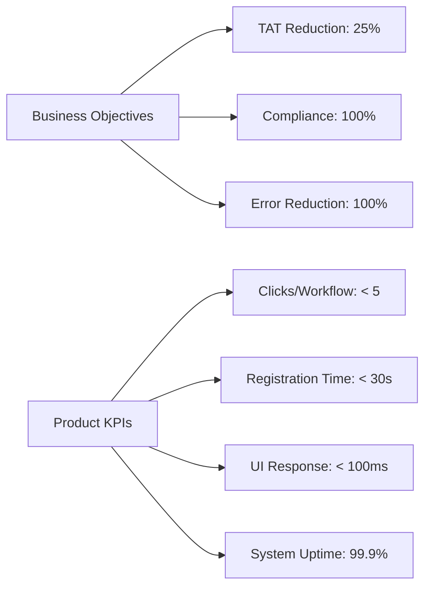

# Product Vision Document

## Document Metadata
*   **Document ID**: LIMS-DOC-01
*   **Version**: 1.0.0
*   **Author**: Antigravity (LIMS Solution Architect)
*   **Status**: Approved
*   **Last Updated**: 2026-07-03
*   **Dependencies**: [LIMS-DOC-00](file:///d:/Projects/Micro_Lab/README.md)
*   **Requested By**: Product Management & Lab Stakeholders
*   **Reviewed By**: Technical Architect & QA Lead
*   **Approved By**: User
*   **Approval Date**: 2026-07-03

---

## Purpose
The purpose of this document is to answer **"Why are we building this?"** by defining the strategic vision, differentiators, constraints, and success definitions for the Microbiology Laboratory Information Management System (Microbiology LIMS). It acts as the conceptual anchor for all downstream business workflows and technical requirements.

---

## Scope
This document covers the high-level business goals, product KPIs, user stakeholders, success definitions, and long-term vision. It specifies the MVP philosophy and non-goals to focus development and prevent scope drift.

---

## Main Content

### 1. Product Overview
The Microbiology LIMS is a modern, enterprise-grade, web-based, multi-tenant Software-as-a-Service (SaaS) platform custom-tailored to handle the unique, non-linear, and observation-heavy workflows of microbiology labs. Unlike generic clinical LIMS software, this system is designed around the iterative nature of cultures, plate observations, organism identification, and Antimicrobial Susceptibility Testing (AST).

### 2. Vision Statement
To become the most intelligent, workflow-driven, and production-ready Microbiology Laboratory Information Management System that enables laboratories to deliver faster, more accurate, traceable, and compliant microbiological testing through automation, standardization, and seamless digital workflows.

### 3. MVP Philosophy
*   **Production Deployable**: The MVP is not a proof-of-concept or "quick and dirty" prototype. It is a commercial-grade, stable system built to production quality standards from day one.
*   **Extensible Architecture**: Every feature implemented in the MVP must adhere to clean architecture patterns. Future phases will extend existing features rather than refactoring or replacing underlying foundations.

### 4. Product Mission
Build a commercial-grade Microbiology Laboratory Information Management System that laboratories can confidently deploy in production, developers can confidently maintain, and healthcare professionals can confidently rely upon.

### 5. Product Principles
*   **Workflow First**: Product configurations and navigation must mimic the physical path of specimens and culture growth.
*   **Frontend First**: Complete visual alignment and interactive mock trials must be finalized before developing APIs and databases.
*   **User Experience First**: Maximize readability, minimize diagnostic fatigue, and limit technician page transitions.
*   **Quality By Design**: Built-in automated checks, strict type checking, and schema validations.
*   **Security By Design**: High security guidelines (HIPAA, GDPR, 21 CFR Part 11) are native to the data structures.
*   **Performance By Design**: Pages load instantly; reports generate in seconds; data search indexes are optimized.
*   **Accessibility First**: Complete compliance with WCAG 2.1 AA design systems.
*   **Reusability**: Shared components, logic wrappers, and data models to prevent code duplication.
*   **Scalability**: Micro-modular design supporting independent deployment scaling and multi-tenant isolation.
*   **Maintainability**: Documented clean code following strict linting and engineering standards.
*   **Observability**: Integrated user audits, processing telemetry, and performance tracking.
*   **Auditability**: Complete tracking of "who, what, when, why" for every clinical edit.
*   **Compliance Ready**: System layout matches CLIA, CAP, and ISO 15189 record constraints.

### 6. Why This Product Is Different (Key Differentiators)
*   **Disease-Driven Workflow Engine**: Dynamic stage pathways configured by organism group or specimen source, rather than a single linear status sequence.
*   **Complete Specimen Lifecycle Tracking**: Live visual chains of custody tracking collection, transport, receipt, plate inoculation, observations, validation, and archiving.
*   **Culture-First Architecture**: Structured observation entries supporting multiple readings over days, sub-culture trees, and colony description templates.
*   **Advanced AST Workflow**: Automatic interpretation of zone diameters and Minimum Inhibitory Concentrations (MIC) using integrated clinical standard guidelines (CLSI/EUCAST).
*   **Environmental Monitoring Integration**: Unified logging for laboratory surface swabs, air plates, and incubator quality controls alongside patient results.
*   **End-to-End Auditability**: 21 CFR Part 11 style audits capturing previous and current states for every entry.
*   **Frontend-First UX**: Responsive web interfaces optimized for laboratory monitors, tablets, and barcode scanners.
*   **Component-Driven Architecture**: Fast rendering using a unified, reusable CSS/React component inventory.
*   **Production-Ready Engineering**: Continuous deployment pipelines, automated integration checks, and isolated databases per tenant.
*   **Future AI Integration**: Architecture designed to ingest digital plate imagery for visual colony identification models in later phases.

### 7. Product Constraints
*   **Frontend-First Execution**: The UI layout must be completed and approved with simulated API data before any backend schemas are committed.
*   **Modular Architecture**: Low-coupling modules where functional updates do not affect other modules.
*   **API-First Core**: All client actions correspond to clean RESTful or WebSocket endpoints, facilitating future mobile app development.
*   **Cloud Ready**: Containerized deployment structures suited for Docker, Kubernetes, and major cloud providers.
*   **Multi-Tenant Isolation**: Complete logical database separation using isolated tenant keys, supporting future physical split capabilities.
*   **Offline Ready (Future Path)**: Client architecture designed to store state offline in local storage to buffer network drops at critical moments.
*   **Component Driven**: Built entirely from the core design system guidelines.
*   **Fully Responsive**: Interface fits standard desktop screens, wall-mounted monitors, and mobile tablets.
*   **No Vendor Lock-In**: Open standard storage, REST APIs, and standard frameworks (React/Node) to ensure long-term portability.

### 8. Stakeholders & Target Users

| Stakeholder Category | Primary Objective / Concern in LIMS |
| :--- | :--- |
| **Laboratory Owner** | Business profitability, lower CAC, quick tenant onboarding, and client retention. |
| **Laboratory Manager** | Quality compliance, daily workflow throughput, technician workloads, and meeting TAT SLAs. |
| **Hospital Administrator** | Seamless billing exports, patient record matching (EHR links), and overall diagnostic quality. |
| **Quality Officer** | Verification of QC checklists, compliance tracking, and immediate retrieval of historic audits. |
| **IT Administrator** | Server security, multi-tenant database isolation, simple deployment, and REST API structures. |
| **Patients** | Timely, clear, and secure access to diagnostic reports via secure online portals. |
| **Ordering Physicians (Doctors)** | Quick diagnostic TAT, clear AST interpretation charts, and reliable preliminary updates. |
| **Regulatory Auditors** | Strict 21 CFR Part 11 compliance tracking, historical print records, and user login logs. |
| **Sales & Support Teams** | Zero-downtime deployment, simple configuration dashboards, and responsive customer help tools. |
| **Lab Technician / Specimen Processor** | Rapid specimen check-ins, barcode scan speed, and structured observation drop-downs. |

### 9. Business Objectives & Product KPIs

#### Business Objectives
*   **TAT Reduction**: Cut clinical turnaround times by 25% via automatic incubation timelines.
*   **Compliance Compliance**: 100% audit accuracy for HIPAA, CAP, and CLIA reviews.
*   **Operational Capacity**: Process 20% more daily cultures per technician.

#### Product KPIs
*   **Clicks per Core Workflow**: Under 5 clicks to register, observe, or validate a specimen.
*   **Specimen Registration Time**: Average time from patient entry to barcode generation under 30 seconds.
*   **Report Generation Time**: PDF compilation and rendering under 2 seconds.
*   **UI Response Latency**: Core state changes render in less than 100 milliseconds.
*   **Search and Filter Response**: Specimen database query returns in under 300 milliseconds.
*   **System Error and Crash Rate**: Zero UI page crashes; server API error rates below 0.1%.
*   **System Uptime**: Minimum uptime target of 99.9%.

### 10. Non-Goals
The LIMS is built specifically for microbiology. To ensure focus, the following systems are **Out of Scope**:
*   **General Hospital ERP**: We are not building hospital patient stay checkers or ward management systems.
*   **General Clinical Chemistry/Hematology LIS**: The system is not designed to process bulk automated serum analyzers.
*   **Corporate Accounting Software**: No tax filings, complex ledger management, or general ledger integration.
*   **HR Management Systems**: No staff timesheets, payroll systems, or employee onboarding managers.
*   **Inventory ERP**: Only simple tracking of active laboratory agar lots, not full warehouse stock forecasting.
*   **Medical Diagnosis AI**: The system logs human clinical decisions but does not automatically prescribe medication or make autonomous diagnostic calls.

---

## Assumptions
*   A certified clinical microbiologist validates all critical culture and susceptibility data before final report generation.
*   Security architectures assume standard cloud firewall configurations and end-user browser security protocols.

---

## Future Enhancements
*   Mobile integration protocols for offline plate scan queueing.
*   Federated national infectious disease monitoring endpoints.

---

## Review Checklist
- [x] Vision statement incorporates workflow alignment, standardization, and speed.
- [x] Product principles explicitly list frontend-first, UX-first, auditability, and compliance-ready terms.
- [x] Unique differentiators are defined to separate this from clinical hematology LIMS.
- [x] Operational and system level Product KPIs are documented.
- [x] MVP philosophy is defined as production deployable.
- [x] Non-goals are clearly detailed to keep development scope focused.
