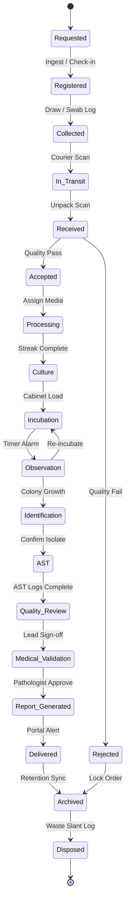

# Software Requirements Specification (SRS)

## Document Metadata
*   **Document ID**: LIMS-DOC-04
*   **Version**: 1.0.0
*   **Author**: Antigravity (LIMS Solution Architect)
*   **Status**: Approved
*   **Last Updated**: 2026-07-03
*   **Dependencies**: [LIMS-DOC-03](file:///d:/Projects/Micro_Lab/docs/03_business_requirements.md)
*   **Requested By**: Technical Leadership & Development Stakeholders
*   **Reviewed By**: Quality Assurance Lead & Senior Software Engineer
*   **Approved By**: User
*   **Approval Date**: 2026-07-03

---

## Purpose
The purpose of this document is to answer **"What must the software do?"** by translating the approved BRS clinical operations into detailed, testable functional and non-functional software specifications. This SRS serves as the engineering contract between UI developers, backend developers, and QA engineers.

---

## Scope
This document details functional requirements across all 16 system modules, including state machine definitions, CRUD mapping tables, UI behavior, mock engines, error codes, and audit specifications. It includes a traceability index to map developer requirements back to vision goals.

---

## Main Content

### 1. Specimen State Machine Configuration
The software workflow engine must enforce the transition paths below. Any API request attempting an invalid state transition must return `ERR-003` (Rejected Sample Transition) and be blocked.

---

### 2. Unified Module CRUD Matrix

The table below defines the system's role-based access gates:

| Module Prefix | Module Name | Processor | Technician | Lead Microbiologist | Pathologist | Admin |
| :--- | :--- | :--- | :--- | :--- | :--- | :--- |
| **REQ-AUTH** | Authentication / Login | R | R | R | R | C, R, U, D |
| **REQ-DASH** | System Workspaces | R | R | R, A | R, A | R |
| **REQ-PAT** | Patient Registry | C, R, U | R | R | R | R, D |
| **REQ-CLI** | Client Registry | C, R, U | R | R | R | R, D |
| **REQ-SMP** | Specimen Management | C, R, U | C, R, U | C, R, U | R | R, D |
| **REQ-CUL** | Culture Inoculation | R | C, R, U | C, R, U | R | R |
| **REQ-OBS** | Incubation & Reading | R | C, R, U | C, R, U | R | R |
| **REQ-ORG** | Pathogen Identification| R | C, R, U | C, R, U | R | R |
| **REQ-AST** | Susceptibility Tables | R | C, R, U | C, R, U | R | R, U |
| **REQ-INV** | Media & Disk Lots | R | R, U | C, R, U | R | C, R, U, D |
| **REQ-BILL** | Direct Billing & CPT | C, R, U | R | R | R | R, D |
| **REQ-REP** | PDF Reporting Engine | R, P | R, P | R, P | R, A, P, E | R |
| **REQ-ENV** | Environment Monitor | R | C, R, U | C, R, U | R | R |
| **REQ-AUD** | 21 CFR 11 Audit Trail | None | None | R | R | R, E |
| **REQ-SET** | Breakpoint Parameters | R | R | R | R | C, R, U |
| **REQ-ADM** | Tenant Administration | None | None | None | None | C, R, U, D |

*Legend: C = Create, R = Read, U = Update, D = Delete, A = Approve/Validate, P = Print, E = Export*

---

### 3. Core Software Requirement Specifications

#### 3.1 Patient Registration (REQ-PAT-001)
*   **Requirement ID**: REQ-PAT-001
*   **Requirement Name**: Patient Demographic Verification & Duplicate Lock
*   **Description**: Verify input details and prevent patient profile replication.
*   **Business Justification**: Maintain clinical record safety and prevent duplicate charts.
*   **Priority**: P0 | **Status**: Approved
*   **Dependencies**: LIMS-DOC-03 (Sec 2)
*   **Preconditions**: Processor is logged in and active patient lookup database query is online.
*   **Functional Rules**:
    *   System must query database using `first_name` + `last_name` + `birth_date`.
    *   If query returns a match, display immediate floating warning alert.
*   **Validation Rules**: Name must be string only ($<100$ characters). Birth date must be in past.
*   **Acceptance Criteria**:
    *   *Given*: A user types in "John", "Doe", and "1980-05-15" in registration form.
    *   *When*: The field cursor exits the date selector.
    *   *Then*: An asynchronous lookup runs, finds a match, and displays "ERR-001: Patient Match Found. Proceed to link existing MRN?" on the layout.
*   **Error Handling**: If check query times out, proceed but log a warning status badge.
*   **Audit Requirements**: Log user ID, timestamp, patient MRN checked, and search variables.
*   **Security Requirements**: PHI details must mask last four digits of social number.
*   **Test Cases**: Unit test (regex check on birth date), E2E test (simulate dual registration check).
*   **Future Enhancements**: Integration with hospital MPI.

#### 3.2 Specimen Receipt Inspection (REQ-SMP-001)
*   **Requirement ID**: REQ-SMP-001
*   **Requirement Name**: Barcode-driven Receipt Checklist
*   **Description**: Enforce quality checklist before specimen status shifts to Accepted.
*   **Business Justification**: Stop degraded samples from entering lab processing.
*   **Priority**: P0 | **Status**: Approved
*   **Dependencies**: REQ-SMP
*   **Preconditions**: Specimen physical container is scanned at the receipt bench.
*   **Functional Rules**:
    *   Force technician to select Yes/No on container check flags: Leaking, Volume, Label Match.
    *   If any flag is set to Fails, force entry of Rejection Code.
*   **Validation Rules**: Rejection code must match pre-configured keys (e.g. `REJ-QNS`, `REJ-LBL`).
*   **Acceptance Criteria**:
    *   *Given*: A technician scans barcode `SP-908070` and selects "Leaking = Yes".
    *   *When*: Technician clicks "Confirm Check".
    *   *Then*: System blocks transition to "Accepted", routes status to "Rejected", sets status alert red, and prompt direct CAPA ticket trigger.
*   **Error Handling**: Output `ERR-003` if incorrect sample transition attempted.
*   **Audit Requirements**: Save checklist inputs, Rejection Code, technician ID, and timestamp.
*   **Security Requirements**: Restrict receipt logging to processors and technicians.
*   **Test Cases**: Integration test (Receipt check action validation).
*   **Future Enhancements**: Automated scanner box checklist triggers.

#### 3.3 AST susceptibility automated interpreter (REQ-AST-001)
*   **Requirement ID**: REQ-AST-001
*   **Requirement Name**: Automatic breakpoint mapping interpretation
*   **Description**: Translate zone diameters and MIC values to S/I/R output using CLSI guidelines.
*   **Business Justification**: Prevent physician medication choice translation errors.
*   **Priority**: P0 | **Status**: Approved
*   **Dependencies**: LIMS-DOC-03 (Sec 4)
*   **Preconditions**: Pathogen isolate confirmed and AST panel active.
*   **Functional Rules**:
    *   Cross-reference input value against CLSI tables with organism ID, specimen type, and drug name.
    *   Output S, I, or R badge styling dynamically.
*   **Validation Rules**: Zone diameter must be $6 \le \text{value} \le 50$ mm. MIC must be standard dilutions.
*   **Acceptance Criteria**:
    *   *Given*: Isolate is *Escherichia coli*, drug is Ampicillin, input disk zone is 12mm.
    *   *When*: Technician submits values.
    *   *Then*: The system queries CLSI database and displays "R" (Resistant) in red styling beside the drug entry.
*   **Error Handling**: If lookup is out of range, display `ERR-005` (AST Validation Failed).
*   **Audit Requirements**: Track previous value, computed value, rule ID triggered, and technician ID.
*   **Security Requirements**: Read-only calculations; manual override requires double sign-off.
*   **Test Cases**: Unit test (verify susceptibility ranges for 10 core pathogens).
*   **Future Enhancements**: Auto-import parameters directly from AST machines.

---

### 4. Application UI Behavior & Mock Strategy (Frontend First)
To build a highly responsive, standalone frontend before the backend database exists:
*   **Loading States**: All tables, form actions, and report generation triggers must implement skeleton loaders or overlay spinners.
*   **Empty States**: Clear illustration screens detailing action directives when registries are empty.
*   **Validation Layouts**: Input borders must render in green (valid) or red (invalid) real-time; error tooltip text must display below the input fields.
*   **Mock Service Worker (MSW)**: The client application must configure Mock Service Worker to intercept all API requests and return deterministic mock JSON responses, simulating server latency (e.g. 500ms delay) to test loading states.
*   **Offline Simulation**: If local connectivity drops, the client must queue mutations in an IndexedDB buffer, displaying a yellow "Sync Pending" badge, and retry posting when online.

---

### 5. System Error Codes Schema

| Error Code | Title | Description / Error Message UI |
| :--- | :--- | :--- |
| **ERR-001** | Duplicate Patient | "Match Found: A patient record with this Name and Date of Birth already exists." |
| **ERR-002** | Invalid Barcode | "Unreadable Barcode: Specimen ID format does not match LIMS alphanumeric template." |
| **ERR-003** | Rejected Sample Transition | "Transition Denied: Rejected specimens cannot progress to laboratory processing." |
| **ERR-004** | Unauthorized Access | "Access Denied: Your user account lacks the required permissions to perform this action." |
| **ERR-005** | AST Breakpoint Error | "Susceptibility Error: Input diameter or MIC is outside standard CLSI validation ranges." |
| **ERR-006** | Expired Media Lot | "Inventory Error: Selected culture agar media lot is expired or unapproved." |
| **ERR-007** | Missing Call Log | "Validation Blocked: Critical value alerts require telephone confirmation log before release." |
| **ERR-008** | Invalid Input Volume | "Input Error: Entered specimen quantity is below minimum clinical container thresholds." |

---

### 6. Logging Specifications

The system must log technical parameters at six levels, filtering out Patient PHI details:
1.  **INFO**: Standard operational events (e.g. user navigation, search completions, report views).
2.  **WARNING**: Validation deviations (e.g. bad logins, invalid form inputs, offline sync buffer retries).
3.  **ERROR**: Recoverable errors (e.g. barcode print queue drops, mail server delivery timeout).
4.  **CRITICAL**: Severe operational disruptions (e.g. database connection pool exhaustion).
5.  **AUDIT**: Patient-related clinical modifications (e.g. result updates, path overrides). Includes: User, Specimen ID, Field name, Old value, New value, Reason.
6.  **SECURITY**: Security alerts (e.g. role access denials, invalid JWT signatures, login locks).

---

### 7. Traceability Matrix

| Vision Goal | BRS Section | SRS ID | Test Verification Case |
| :--- | :--- | :--- | :--- |
| **Goal 2: User Adoption** | Sec 7 (Processor role) | REQ-PAT-001 | TC-PAT-REG-01 (Check duplicate prompt trigger) |
| **Goal 3: Operational Quality** | Sec 2 (Quality Checks) | REQ-SMP-001 | TC-SMP-REC-02 (Verify rejection rules block media streak) |
| **Goal 3: Operational Quality** | Sec 4 (Susceptibility) | REQ-AST-001 | TC-AST-VAL-03 (Check CLSI calculations for *E. coli*) |
| **Goal 4: Audit Preparedness** | Sec 6 (Signature logs) | REQ-VAL-04 | TC-VAL-AMD-04 (Check supersede revision tracking) |

---

## Assumptions
*   The client browser has standard LocalStorage, SessionStorage, and IndexedDB enabled.
*   System administrators maintain access to raw DB tables to fix sync database collisions if necessary.

---

## Future Enhancements
*   Connecting automated telemetry diagnostics for print queue monitors.
*   Full integration with international clinical guidelines databases.

---

## Review Checklist
- [x] Functional requirements maps to all 16 module prefixes.
- [x] Sample transition diagram matches the BRS lifecycle path.
- [x] CRUD access restrictions match the user permission matrix.
-  [x] Includes the standard given/when/then templates for core requirements.
- [x] Formulates a standard Error Codes schema table.
- [x] Includes traceability matrix linking Vision to SRS.
- [x] Document follows the LIMS-DOC template structure.
