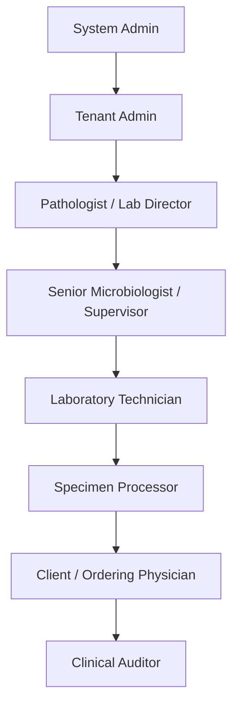

# User Roles & Permission Matrix

## Document Metadata
*   **Document ID**: LIMS-DOC-05
*   **Version**: 1.0.0
*   **Author**: Antigravity (LIMS Solution Architect)
*   **Status**: Approved
*   **Last Updated**: 2026-07-03
*   **Dependencies**: [LIMS-DOC-04](file:///d:/Projects/Micro_Lab/docs/04_software_requirements.md)
*   **Requested By**: Information Security Officer & Laboratory Director
*   **Reviewed By**: Solution Architect & Quality Assurance Lead
*   **Approved By**: User
*   **Approval Date**: 2026-07-03

---

## Purpose
The purpose of this document is to answer **"How does the laboratory operate?"** by establishing a comprehensive, granular, permission-based access control framework. It acts as the contract for frontend UI rendering, API endpoint security guards, database role mappings, and compliance audit validation.

---

## Scope
This document covers user authorization matrices, field-level access, workflow sign-off limits, break-glass emergency access rules, delegate setups, tenant hierarchies, and authentication policies for the LIMS.

---

## Main Content

### 1. Role Hierarchy & Inheritance Model
The system enforces a top-down role inheritance tree. Users in higher roles automatically inherit the permissions of downstream roles unless specifically restricted by clinical separation constraints:

---

### 2. Standard Permission Constants Naming Convention
To ensure consistency across frontend controls and backend guards, the system utilizes the following constant strings:
*   `PATIENT_CREATE` / `PATIENT_READ` / `PATIENT_UPDATE` / `PATIENT_DELETE`
*   `SPECIMEN_RECEIVE` / `SPECIMEN_REJECT` / `SPECIMEN_TRANSFER`
*   `CULTURE_PLATE` / `CULTURE_INCUBATE` / `CULTURE_OBSERVE`
*   `ISOLATE_IDENTIFY` / `AST_RECORD` / `AST_OVERRIDE`
*   `REPORT_GENERATE` / `REPORT_APPROVE` / `REPORT_AMEND`
*   `BILLING_MANAGE` / `BILLING_VIEW`
*   `AUDIT_VIEW` / `AUDIT_EXPORT`
*   `QC_LOT_MANAGE` / `CAPA_LOG`
*   `TENANT_MANAGE` / `USER_MANAGE`

---

### 3. Module & Action Permission Matrix
The table below maps standard operations per LIMS module:

| Module Domain | Action Perm Required | Processor | Technician | Sr. Micro | Pathologist | Admin | Auditor |
| :--- | :--- | :---: | :---: | :---: | :---: | :---: | :---: |
| **Patient Demographics** | `PATIENT_CREATE` / `_UPDATE` | C, U | R | R | R | C, U, D | R |
| **Specimen Ingestion** | `SPECIMEN_RECEIVE` / `_REJECT` | C, U | C, U | C, U | R | R | R |
| **Culture Logging** | `CULTURE_PLATE` / `_INCUBATE` | R | C, U | C, U | R | R | R |
| **Plate Observations** | `CULTURE_OBSERVE` | - | C, U | C, U | R | R | R |
| **Taxonomy species ID** | `ISOLATE_IDENTIFY` | - | C, U | C, U | R | R | R |
| **AST Susceptibility** | `AST_RECORD` | - | C, U | C, U | R | - | R |
| **AST Interpretation Override**| `AST_OVERRIDE` | - | - | C, U | C, U | - | R |
| **Medical Validation** | `REPORT_APPROVE` | - | - | - | C, A | - | R |
| **Amended Reports** | `REPORT_AMEND` | - | - | - | C, U | - | R |
| **Direct Billing** | `BILLING_MANAGE` | C, U | R | R | R | C, U, D | R |
| **Audit Log Trail** | `AUDIT_VIEW` | - | - | R | R | R | R, E |
| **Quality Lot Controls** | `QC_LOT_MANAGE` | - | R | C, U | C, U | C, U, D | R |
| **Tenant Settings** | `TENANT_MANAGE` | - | - | - | - | C, U | - |

*Legend: C = Create, R = Read, U = Update, D = Delete, A = Approve/Validate, E = Export*

---

### 4. Screen-Level Rendering & Editable Matrix
This table defines access configurations for standard application screens:

| Screen View | Visible To | Editable By | Export Allowed | Print Allowed | Delete Allowed |
| :--- | :--- | :--- | :--- | :--- | :--- |
| **Dashboard** | All | None | None | None | None |
| **Registration** | Processor, Admin | Processor, Admin | None | Processor | Admin |
| **Sample Receipt** | Processor, Tech, Admin | Processor, Tech | None | Processor, Tech | Admin |
| **Culture / Incubation**| Tech, Sr. Micro, Admin | Tech, Sr. Micro | Tech | Tech | None |
| **Observations** | Tech, Sr. Micro, Path | Tech, Sr. Micro | Sr. Micro | Tech | None |
| **ASTsusceptibility**| Tech, Sr. Micro, Path | Tech, Sr. Micro | Sr. Micro | Tech | None |
| **Validation Workspace**| Sr. Micro, Pathologist | Pathologist | Pathologist | Pathologist | None |
| **Reports Archive** | All | Pathologist (Amend) | Pathologist, Auditor | All | None |
| **Billing Workspace** | Processor, Admin | Processor, Admin | Admin | Processor | Admin |
| **QC & CAPA Ledger** | Tech, Sr. Micro, Path, Aud | Sr. Micro, Admin | Auditor, Admin | All | None |
| **Audit trail logs** | Sr. Micro, Path, Aud, Admin | None (Read-only) | Auditor, Admin | Auditor | None |
| **User Settings** | System Admin | System Admin | Admin | None | Admin |

---

### 5. Field-Level Access Control Rules
The LIMS enforces granular constraints at the individual input level to protect data integrity:

#### 5.1 Patient Registration Screen
*   **First/Last Name, DOB, Sex**: Editable by Specimen Processor and Admin. Read-only for all other roles.
*   **Medical Record Number (MRN)**: Auto-generated by system. **Read-only for all roles** (including Admin). Duplicate profile merges must occur via administrative merge tooling only.

#### 5.2 Laboratory Result Forms
*   **Gram Stain / Plate Count / Colony Description**: Editable by Laboratory Technician and Senior Microbiologist. Read-only for Pathologists and Processors.
*   **Organism Species ID Lookup**: Editable by Laboratory Technician and Senior Microbiologist. Read-only for Pathologists.
*   **Antibiotic Zone Diameter / MIC Numeric Input**: Editable by Laboratory Technician and Senior Microbiologist. Read-only for Pathologists.
*   **Susceptibility S/I/R output**: Computed dynamically. **Read-only for all roles**. The calculated value can only be overridden by Senior Microbiologist or Pathologist, prompting a mandatory override justification entry.

---

### 6. Workflow State Transition Matrix
Specimen lifecycle status updates (Start $\rightarrow$ Move $\rightarrow$ Finalize) are gated by role scope:

| Status State | Allowed Active Role | Next Allowed States | Allowed Exceptions |
| :--- | :---: | :--- | :--- |
| **Requested** | Ordering Physician | Registered, Collected | Canceled |
| **Registered** | Specimen Processor | Collected | Rejected |
| **Collected** | Phlebotomist / Nurse | In Transit | Rejected |
| **In Transit** | Courier / Driver | Received | Rejected |
| **Received** | Specimen Processor | Accepted, Rejected | None |
| **Accepted** | Specimen Processor | Processing | None |
| **Rejected** | Specimen Processor | Archived (Locked) | None |
| **Processing** | Laboratory Technician | Culture | None |
| **Culture** | Laboratory Technician | Incubation | None |
| **Incubation** | Laboratory Technician | Observation | Equipment Failure |
| **Observation** | Laboratory Technician | Identification, Incubation | Contaminated Culture |
| **Identification**| Laboratory Technician | AST, Quality Review | Contaminated Culture |
| **AST** | Laboratory Technician | Quality Review | AST Repeated |
| **Quality Review**| Senior Microbiologist | Medical Validation | AST Repeated |
| **Medical Validation** | Pathologist / Director | Report Generated | Quality Review (Rollback) |
| **Report Generated** | System Engine / Pathologist | Delivered | Report Amended |
| **Delivered** | System Engine | Archived | None |
| **Archived** | System Administrator | Disposed | None |

---

### 7. Core Operational Approval Matrix
Activities requiring authorization:

| Laboratory Activity | Technician | Senior Microbiologist | Pathologist / Lab Director |
| :--- | :---: | :---: | :---: |
| **Release Preliminary Report** | ✅ Allowed | ✅ Allowed | ✅ Allowed |
| **Release Final Report** | ❌ Blocked | ❌ Blocked | ✅ Allowed |
| **Unlock Amended Report** | ❌ Blocked | ❌ Blocked | ✅ Allowed |
| **Bypass AST Expert Breakpoint** | ❌ Blocked | ✅ Allowed | ✅ Allowed |
| **Approve Expired Media Lot** | ❌ Blocked | ✅ Allowed | ✅ Allowed |
| **Register CAPA Incident Close**| ❌ Blocked | ✅ Allowed | ✅ Allowed |

---

### 8. UI Security Denial Behavior Strategy
If a user lacks permission for an action, the UI must apply standard behaviors:
*   **No Read Access**: The navigation link is hidden from the sidebar. Accessing the direct URL must trigger a local routing redirect to `/unauthorized` displaying error toast `ERR-004`.
*   **Read-Only Access**: Input fields render with disabled attributes (greyed out); edit buttons and submit buttons are omitted from the viewport layout.
*   **Action Denied**: If a user attempts to bypass UI restrictions, the backend API checks scopes and returns `ERR-004`, triggering an immediate browser session lock.

---

### 9. API Authorization Mapping

Every network request is checked for scope permissions:

| Endpoint | HTTP Method | Required Permission | Audit Logged? |
| :--- | :--- | :--- | :---: |
| `/api/patients` | POST | `PATIENT_CREATE` | Yes |
| `/api/patients/:id` | PUT | `PATIENT_UPDATE` | Yes |
| `/api/specimens/receive` | POST | `SPECIMEN_RECEIVE` | Yes |
| `/api/specimens/reject` | POST | `SPECIMEN_REJECT` | Yes |
| `/api/cultures/incubate` | POST | `CULTURE_INCUBATE` | Yes |
| `/api/ast/results` | POST | `AST_RECORD` | Yes |
| `/api/ast/override` | POST | `AST_OVERRIDE` | Yes |
| `/api/reports/:id/validate`| POST | `REPORT_APPROVE` | Yes |
| `/api/reports/:id/amend` | POST | `REPORT_AMEND` | Yes |
| `/api/users` | POST | `USER_MANAGE` | Yes |

---

### 10. Data Ownership & Scope
*   **Patient Profile**: Owned by clinic registry; editable by Specimen Processors and Admins.
*   **Specimen Container**: Owned by lab receiving department; editable by Processors and Technicians.
*   **Isolate Results & Susceptibility Grid**: Owned by testing department; editable by Technicians and Senior Microbiologists.
*   **Finalized Clinical Report**: Owned by medical directors; editable strictly by Pathologists via Amended loops.
*   **Guideline and Breakpoint Settings**: Owned by tenant administrator; editable by Admin.

---

### 11. Break-Glass Emergency Override Protocol
In extreme clinical emergencies (e.g. disaster recovery, primary pathologist unavailable during outbreak validation):
1.  **Trigger Action**: Senior Microbiologists can activate the "Break-Glass Override" button on the validation dashboard.
2.  **Mandatory Input**: User must input their passcode credentials and select a valid reason code, plus write a detailed justification block.
3.  **Security Notification**: An immediate webhook notification alert is sent to the Hospital Quality Officer and Laboratory Director.
4.  **Audit Lock**: The action is logged under severity level `SECURITY` inside the read-only audit log tables, locking the overridden reports for validation review.

---

### 12. Task Delegation Rules
Users can delegate their authorities during periods of leave:
*   **Creation Parameters**: A Pathologist or Senior Microbiologist can configure a delegation ticket setting: *Delegate ID, Start Date, End Date, Allowed Scopes*.
*   **Audit Lock**: The delegation ticket creation is logged in the system audits.
*   **Enforcement Loop**: During the active period, the delegate inherits the specified roles.
*   **Auto-Expiry**: At 23:59:59 on the End Date, the delegation token automatically expires and is deleted from the active session cache.

---

### 13. Authentication & Security Policies
*   **Password Policy**: Passwords must contain $\ge 12$ characters, including uppercase, lowercase, numbers, and symbols.
*   **Account Lockout**: User accounts lock for 30 minutes after 5 consecutive failed login attempts.
*   **Session Lifetimes**: Absolute logout after 15 minutes of inactivity; session tokens stored strictly in HTTP-only cookies.
*   **Concurrent Sessions**: A user profile is limited to exactly one active login session. Logging in from a second terminal automatically invalidates the previous session cookie.
*   **Password Expiry**: Enforced password resets every 90 days.

---

## Assumptions
*   All personnel mapping to LIMS roles possess valid, active corporate user credentials.
*   The email server supports secure SMTP connections to deliver credential reset links.

---

## Future Enhancements
*   Implementing biometric (FIDO2) authentication hardware keys.
*   Mapping permissions dynamically to external LDAP and Active Directory security groups.

---

## Review Checklist
- [x] Includes a detailed Permission Matrix table (CRUD scopes).
- [x] Defines Screen-Level visibility and edit permission parameters.
- [x] Specifies Field-Level constraints for Patient and Result inputs.
- [x] Integrates workflow role checks matching the BRS.
- [x] Contains an Approval Matrix table for preliminary/final reports.
- [x] Includes Break-Glass Emergency Override Protocols.
- [x] Documents delegation rules with auto-expiry constraints.
- [x] Contains strict user authentication requirements (lockout, timeout).
- [x] Specifies API permission mappings.
- [x] Document follows the LIMS-DOC template structure.
