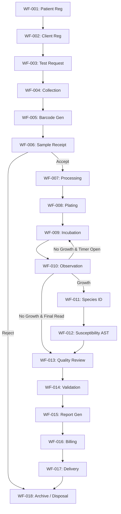

# End-to-End Laboratory Workflow

## Document Metadata
*   **Document ID**: LIMS-DOC-06
*   **Version**: 1.0.0
*   **Author**: Antigravity (LIMS Solution Architect)
*   **Status**: Approved
*   **Last Updated**: 2026-07-03
*   **Dependencies**: [LIMS-DOC-05](file:///d:/Projects/Micro_Lab/docs/05_user_roles_permissions.md)
*   **Requested By**: Laboratory Director & Clinical Quality Manager
*   **Reviewed By**: Solution Architect & Senior Microbiologist
*   **Approved By**: User
*   **Approval Date**: 2026-07-03

---

## Purpose
The purpose of this document is to answer **"How does the laboratory operate?"** by providing a detailed step-by-step clinical mapping of a specimen's path through the laboratory. It maps real-world clinical protocols into explicit data transitions, serving as the core business workflow blueprint.

---

## Scope
This document details the 18 clinical stages (WF-001 to WF-018) of the specimen lifecycle. It defines inputs, outputs, UI screens, API services, data ownership, rollback transitions, exception paths, and expected turnaround times.

---

## Main Content

### 1. Clinical Lifecycle Timeline Flow

---

### 2. Rollback & Transition Rules
*   **Allowed Rollbacks**:
    *   `WF-014 (Medical Validation)` $\rightarrow$ Rollback to `WF-013 (Quality Review)` or `WF-012 (AST)` or `WF-010 (Observation)` (e.g. pathologist requests re-read or repeat disc diffusion).
    *   `WF-013 (Quality Review)` $\rightarrow$ Rollback to `WF-012 (AST)` (e.g. supervisor flags anomaly, requests disk repeat).
    *   `WF-010 (Observation)` $\rightarrow$ Rollback to `WF-009 (Incubation)` (e.g. plate needs further 24-hour incubation).
*   **Forbidden Rollbacks**:
    *   Once a report is validated and moves to `WF-015 (Report Generated)`, **no direct rollbacks are allowed**. Updates must occur via the formal **Amended Report Workflow** (locks edits, archives the old file, registers change reasons).
    *   A specimen in state `Rejected` in `WF-006` cannot roll back to `Accepted` or proceed to processing without creating a new order ticket.

---

### 3. Parallel Process Flows
*   **Parallel Plating (WF-007 / WF-008)**: Specimen aliquots are streaked onto multiple media agar plates in parallel (e.g., Blood Agar, MacConkey Agar, and Chocolate Agar) by the technician during the same inoculation workstation session.
*   **Split Incubation (WF-009)**: Prepared plates are split and incubated in parallel inside separate cabinets (e.g., Plate A inside standard Aerobic Incubator, Plate B inside CO2 Incubator). The LIMS tracks the incubation timers for each plate separately under the parent Specimen ID.

---

### 4. Consolidated Workflow Specification Directory

The matrix below documents the step-by-step metadata for the 18 stages:

| ID | Stage Name | Screen Map | API & Service Owner | Read / Write Data Entities | SLA TAT Limits | Notifications Sent | Audit Event Captured |
| :--- | :--- | :--- | :--- | :--- | :--- | :--- | :--- |
| **WF-001** | Patient Registration | Registration Screen | `POST /patients` Patient Service | **Read**: None **Write**: Patient | None (Intake) | None | Create Patient ID, User ID, Timestamp, client IP. |
| **WF-002** | Client Registration | Client Directory | `POST /clients` Client Service | **Read**: None **Write**: Client organization | None (Intake) | None | Create Client NPI, User ID, Timestamp. |
| **WF-003** | Test Request | Order Placement | `POST /orders` Order Service | **Read**: Patient, Client **Write**: Specimen Order | Expected: 10 mins Max: 30 mins | Reception Queue | Create Specimen ID, status=Requested, User ID. |
| **WF-004** | Specimen Collection | Order Directory | `PUT /specimens/:id/collect` Specimen Service | **Read**: Specimen Order **Write**: Specimen status | Expected: 20 mins Max: 60 mins | Phlebotomy Queue | Set status=Collected, collection timestamp, user. |
| **WF-005** | Barcode Generation | Order Workspace | `POST /specimens/:id/barcode` Print Service | **Read**: Specimen Order **Write**: Print queue | Expected: 1 min Max: 5 mins | None | Log barcode string printed, template type, user. |
| **WF-006** | Specimen Receipt | Receipt Bench | `PUT /specimens/:id/receive` Specimen Service | **Read**: Specimen Order **Write**: Specimen status | Expected: 1 Hour Max: 4 Hours | Receiving Alert | Set status=Accepted/Rejected, quality check log, user. |
| **WF-007** | Specimen Processing | Plating Bench | `PUT /specimens/:id/process` Specimen Service | **Read**: Specimen Order **Write**: Specimen status | Expected: 30 mins Max: 2 Hours | Lab Workstation | Set status=Processing, processing timestamp, user. |
| **WF-008** | Culture Plating | Media Streaking | `POST /plates` Culture Service | **Read**: Specimen Order **Write**: Culture Plate | Expected: 15 mins Max: 45 mins | None | Create Plate IDs, media lot numbers streaked, user. |
| **WF-009** | Incubation Placement | Cabinet Workspace | `PUT /plates/:id/incubate` Incubation Service | **Read**: Culture Plate **Write**: Incubation logs | Expected: 24-48 Hours Max: 120 Hours | Incubator alert | Set status=Incubation, cabinet ID, shelf, timer, user. |
| **WF-010** | Plate Observation | Observation Screen | `POST /plates/:id/reads` Culture Service | **Read**: Culture Plate, Incubation logs **Write**: Observation log | Expected: 24 Hours Max: 36 Hours | Tech Alert queue | Create Read log, Gram stain reaction, morphology, user. |
| **WF-011** | Pathogen species ID | Observation Screen | `PUT /specimens/:id/pathogen` Isolate Service | **Read**: Observation log **Write**: Confirmed Isolate | Expected: 1 Hour Max: 4 Hours | QC supervisor | Create Isolate ID, taxonomic species selection, user. |
| **WF-012** | AST Susceptibility | AST Entry Screen | `POST /ast/results` AST Service | **Read**: Confirmed Isolate **Write**: AST table | Expected: 24 Hours Max: 36 Hours | Pathologist queue | Create AST disk zone/MIC numbers, CLSI S/I/R output. |
| **WF-013** | Quality Review | QC Dashboard | `PUT /reports/:id/review` Quality Service | **Read**: Isolate, AST, QC logs **Write**: Report status | Expected: 2 Hours Max: 6 Hours | Pathologist validation | Set status=Quality Reviewed, QC validation check, user. |
| **WF-014** | Medical Validation | Pathologist Desk | `PUT /reports/:id/validate` Validation Service | **Read**: Approved Report Draft **Write**: Report status | Expected: 2 Hours Max: 8 Hours | Physician Portal, Billing | Set status=Validated, digital signature cryptographic key. |
| **WF-015** | Report Generation | Pathologist Desk | `POST /reports/:id/pdf` Print Service | **Read**: Validated results **Write**: Report PDF file | Expected: 10 seconds Max: 2 mins | Clinic email | Create PDF checksum, lock clinical edits, timestamp. |
| **WF-016** | Billing / Invoicing | Invoicing Desk | `POST /invoices` Billing Service | **Read**: Validated results, Client **Write**: Invoice log | Expected: 24 Hours Max: 48 Hours | Accounting email | Create Invoice ID, fee values, CPT codes, payment flag. |
| **WF-017** | Report Delivery | Physician Portal | `POST /delivery/notify` Notification Service | **Read**: Report PDF file, Client **Write**: Delivery receipt | Expected: 5 mins Max: 30 mins | Physician email, SMS | Create Delivery receipt, notification timestamp, user. |
| **WF-018** | Archival / Disposal | Storage Desk | `PUT /specimens/:id/archive` Archive Service | **Read**: Specimen Order, Plates **Write**: Storage Cabinet coordinates | Expected: 7 Days (Plates) Max: 7 Years (Records) | Lab waste alert | Set status=Archived/Disposed, discard timestamp, user. |

---

### 5. Exception Workflow Procedures
When errors occur, technicians must execute the following corrective business actions:

*   **EXC-001: Barcode Unreadable**
    *   *Path*: Scan failure $\rightarrow$ Set status to "Hold" $\rightarrow$ Search specimen record manually in directory via patient MRN $\rightarrow$ Select "Reprint Label" $\rightarrow$ Document barcode reprint audit event $\rightarrow$ Re-scan and continue.
*   **EXC-002: Sample Leaked**
    *   *Path*: Receipt quality check fails $\rightarrow$ Log Rejection Code `REJ-LEAK` $\rightarrow$ Set status to "Rejected" $\rightarrow$ Send urgent recall notification alert to Ordering Physician $\rightarrow$ Auto-generate duplicate order request template under new specimen ID.
*   **EXC-003: Incubator Cabinet Failure**
    *   *Path*: Incubator temperature alarm registers out-of-bounds $\rightarrow$ Open cabinet logs $\rightarrow$ Move all active agar plates to standby Incubator ID $\rightarrow$ Document cabinet transfer audit event with reason $\rightarrow$ Reset incubation cycle duration timer.
*   **EXC-004: Duplicate Patient Profile**
    *   *Path*: Search returns dual MRN for john Doe $\rightarrow$ Submit "Patient Merge Request" ticket $\rightarrow$ System holds order processing $\rightarrow$ Admin verifies profiles and merges database records $\rightarrow$ Audit trail records merge log $\rightarrow$ Resume order.

---

### 6. Workflow Preconditions & Exit Criteria
Every workflow step must satisfy its preconditions before it may be entered, and its exit criteria before transitioning to the next state:

| Workflow ID | Stage Name | Preconditions | Exit Criteria |
| :--- | :--- | :--- | :--- |
| **WF-001** | Patient Registration | Processor authenticated and active session. | Patient record saved with unique MRN generated. |
| **WF-002** | Client Registration | Patient MRN exists. | Client record saved with validated NPI. |
| **WF-003** | Test Request | Patient and Client profiles active. | Specimen Order created with unique Specimen ID. |
| **WF-004** | Specimen Collection | Specimen Order confirmed; collection container available. | Collection timestamp, site, and collector ID logged. |
| **WF-005** | Barcode Generation | Specimen Order saved; printer online. | Barcode label(s) printed and scan verified. |
| **WF-006** | Specimen Receipt | Barcode printed; specimen physically arrived at lab. | Specimen marked Accepted or Rejected with checklist log. |
| **WF-007** | Specimen Processing | Specimen status = Accepted; media lots approved by QC. | Processing record saved; plating assignment confirmed. |
| **WF-008** | Culture Plating | Processing record logged; streaking equipment available. | Culture plate records created with media lot numbers. |
| **WF-009** | Incubation Placement | Culture plates streaked; incubator cabinet available. | Plates assigned to incubator ID; timer started. |
| **WF-010** | Plate Observation | Incubation timer expired; technician authenticated. | Growth observation log saved (Gram stain, morphology). |
| **WF-011** | Organism Identification | Significant growth declared in WF-010; biochemical tests ready. | Confirmed isolate ID saved with taxonomic species. |
| **WF-012** | AST Susceptibility | Organism identified; susceptibility disc/MIC panel prepared. | AST table saved; S/I/R auto-calculated and stored. |
| **WF-013** | Quality Review | AST complete; QC lot logs verified; supervisor authenticated. | Quality review approved; report queued for pathologist. |
| **WF-014** | Medical Validation | Quality review signed off; pathologist authenticated. | Report cryptographically signed; editing locked. |
| **WF-015** | Report Generation | Validated signature confirmed; PDF engine online. | PDF compiled; checksum stored; report locked read-only. |
| **WF-016** | Billing / Invoicing | Validated report generated; client billing profile active. | Invoice record created with payment status flag set. |
| **WF-017** | Report Delivery | Invoice created; physician email/portal profile active. | Delivery receipt logged; physician email notification sent. |
| **WF-018** | Archival / Disposal | Report delivered; retention period verified. | Records migrated to cold-storage tables; disposal logged. |

---

### 7. Business Event Registry
These events are published by the workflow engine at critical lifecycle moments. They can subscribe to notifications, dashboard indicators, audit logs, and future third-party integrations:

| Event ID | Event Name | Triggered By | Payload | Subscribers |
| :--- | :--- | :--- | :--- | :--- |
| **EVT-001** | Patient Registered | WF-001 complete | `patient_id`, `mrn`, `timestamp` | Audit log |
| **EVT-002** | Specimen Order Created | WF-003 complete | `specimen_id`, `patient_id`, `test_panels` | Reception Dashboard |
| **EVT-003** | Specimen Collected | WF-004 complete | `specimen_id`, `collector_id`, `timestamp` | Phlebotomy Queue |
| **EVT-004** | Specimen Accepted | WF-006 result = Accepted | `specimen_id`, `processor_id`, `timestamp` | Lab Technician Queue |
| **EVT-005** | Specimen Rejected | WF-006 result = Rejected | `specimen_id`, `rejection_code`, `physician_id` | Physician Alert, CAPA Log |
| **EVT-006** | Incubation Started | WF-009 complete | `plate_ids`, `incubator_id`, `start_time`, `sla_deadline` | Incubation Timer Engine |
| **EVT-007** | Observation Logged | WF-010 complete | `plate_id`, `gram_stain`, `morphology`, `technician_id` | Supervisor Dashboard |
| **EVT-008** | Organism Identified | WF-011 complete | `isolate_id`, `species`, `specimen_id` | QC Supervisor, AST Queue |
| **EVT-009** | AST Completed | WF-012 complete | `ast_id`, `isolate_id`, `sir_summary` | Supervisor Dashboard |
| **EVT-010** | Critical Value Flagged | WF-012 / WF-013 critical rule | `specimen_id`, `finding`, `pathologist_id` | Pathologist Alert, Physician Alert |
| **EVT-011** | Quality Review Approved | WF-013 complete | `report_id`, `supervisor_id`, `timestamp` | Pathologist Validation Queue |
| **EVT-012** | Report Validated | WF-014 complete | `report_id`, `pathologist_id`, `signature_hash` | PDF Engine, Billing, Physician Portal |
| **EVT-013** | Report Delivered | WF-017 complete | `report_id`, `delivery_method`, `recipient_id` | Audit log, Analytics |
| **EVT-014** | Specimen Archived | WF-018 complete | `specimen_id`, `archive_location`, `timestamp` | Storage Dashboard |

---

### 8. Workflow KPIs (Laboratory Performance Metrics)
The following operational metrics must be calculated by the analytics engine to feed the laboratory performance dashboard:

| KPI Name | Formula | Target | Dashboard Indicator |
| :--- | :--- | :--- | :--- |
| **Sample Rejection Rate** | `(Rejected / Total Received) × 100%` | $< 1.5\%$ | Red if $> 2\%$ |
| **Average TAT (All cultures)** | `Delivery Timestamp − Registration Timestamp` | $< 48$ Hours | Yellow if $> 36$ Hours |
| **Culture Positivity Rate** | `(Positive Growth / Total Processed) × 100%` | $20\%–40\%$ range | Alert if $< 10\%$ or $> 60\%$ |
| **AST Completion Time** | `AST Saved Timestamp − Organism Identified Timestamp` | $< 24$ Hours | Red if $> 36$ Hours |
| **Critical Notification Time** | `Call Log Timestamp − Critical Flag Timestamp` | $< 15$ Minutes | Red if $> 15$ Minutes |
| **Report Validation Time** | `Validation Timestamp − Quality Review Timestamp` | $< 4$ Hours | Yellow if $> 6$ Hours |
| **Contamination Rate** | `(Contaminated Cultures / Total Cultures) × 100%` | $< 3\%$ | Red if $> 3\%$ |
| **Average Registration Speed** | `Barcode Printed Timestamp − Patient Entry Timestamp` | $< 3$ Minutes | Alert if $> 5$ Minutes |

---

## Assumptions
*   Physician contact profiles contain verified email addresses mapped to the secure notification engine.
*   Automated incubator temperature logging systems function as standard network services.

---

## Future Enhancements
*   Adding automated SMS callback loops for physician confirmation of critical value releases.
*   Direct integration of barcode label commands to automated labeling cabinets.

---

## Review Checklist
- [x] Specifies the 18 steps with explicit Workflow IDs (WF-001 to WF-018).
- [x] Includes rollback transition constraints (allowed vs. forbidden paths).
- [x] Identifies parallel process flows (aerobic/anaerobic incubation splits).
- [x] Formulates a consolidated workflow matrix detailing screens, APIs, and data.
- [x] Documents the 4 core Exception Workflow paths (EXC-001 to EXC-004).
- [x] Maps Expected and Maximum TAT duration limits.
- [x] Specifies Preconditions and Exit Criteria for all 18 workflow stages.
- [x] Defines 14 Business Events (EVT-001 to EVT-014) for notification and audit integration.
- [x] Documents 8 Workflow KPIs with formulas and dashboard alert targets.
- [x] Document follows the LIMS-DOC template structure.
